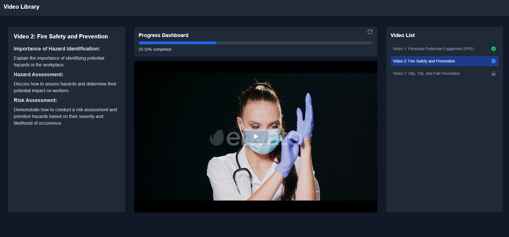
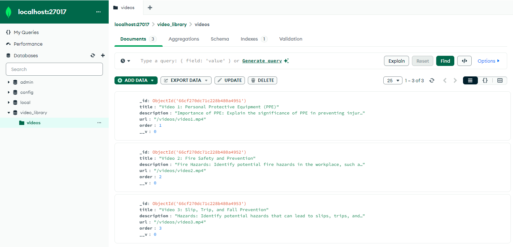

# VideoLibrary

VideoLibrary is a full-stack application that provides an interactive training module for employees to watch video content in sequence.

<p align="center">
  
</p>

## Features

- Sequential video playback
- Resume from last stop
- Back navigation to previously watched videos
- Progress tracking
- Responsive design

## Tech Stack

- Frontend: React
- Backend: Node.js, Express
- Database: MongoDB
- Video Player: Video.js

<p align="center">
  
</p>

## Getting Started

### Prerequisites

- Node.js
- MongoDB

### Installation

1. Clone the repository:
```git clone https://github.com/rohanvron/VideoLibrary.git```

2. Install dependencies:
```cd VideoLibrary npm install cd frontend npm install```

3. Install MongoDB and start the server.

4. Set up environment variables:
Create a `.env` file in the root directory and add:
```MONGODB_URI=your_mongodb_connection_string PORT=5000```

5. Seed the database:
```cd backend npm run seed```

## Project Structure

- `frontend/`: React frontend application

- `backend/`: Express backend server
- `-controllers/`: Request handlers
- `-models/`: Database models
- `-routes/`: API routes
- `-server.js`: Main server file

## API Endpoints

- GET `/api/videos`: Retrieve all videos
- POST `/api/videos/progress`: Update video progress